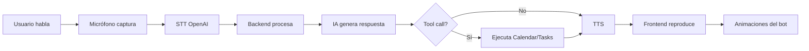

# 🤖 GBot - Asistente Personal con IA

<div align="center">

**Asistente personal inteligente con voz natural, animaciones y conexión con servicios de Google**

[](https://opensource.org/licenses/MIT)
[](https://nodejs.org/)
[](https://reactjs.org/)
[](https://platform.openai.com/)

[Inicio Rápido](#-inicio-rápido) • [Documentación](#-documentación) • [Características](#-características) • [Demo](#-demo)

</div>

---

## 🎯 Características

- 🗣️ **Voz Natural**: Conversación por voz en tiempo real con OpenAI Realtime API
- 🎨 **Animaciones Vivas**: Estados emocionales y reacciones visuales del bot
- 📅 **Google Calendar**: Gestión completa de eventos con comandos de voz
- ✅ **Google Tasks**: Administración inteligente de tareas
- 🧠 **Comportamiento Autónomo**: Recordatorios proactivos y sugerencias
- 💾 **Memoria Persistente**: Contexto de usuario y preferencias
- 🔐 **Seguridad**: OAuth2, JWT, encriptación de tokens
- 🎭 **Personalidad**: Adaptativa según el contexto del usuario

## 🏗️ Arquitectura

```
gbot/
├── backend/          # Node.js + Express + WebSocket
├── frontend/         # React + Animaciones
├── shared/           # Tipos y utilidades compartidas
└── docs/             # Documentación
```

## 🚀 Stack Tecnológico

### Backend
- Node.js + Express
- WebSocket (ws)
- OpenAI SDK v4
- Google APIs (Calendar, Tasks)
- Supabase (Base de datos)
- JWT + OAuth2

### Frontend
- React 18
- Lottie/Rive (Animaciones)
- Web Audio API
- TailwindCSS
- Lucide Icons

## 📋 Requisitos Previos

- Node.js 18+
- Cuenta OpenAI con API Key
- Proyecto Google Cloud con OAuth2
- Cuenta Supabase (opcional)

## ⚡ Inicio Rápido

### Opción 1: Configuración Automática (Recomendado)

```bash
# 1. Instalar dependencias
npm run install:all

# 2. Configurar (interactivo)
npm run setup

# 3. Iniciar aplicación
npm run dev
```

Abre `http://localhost:3000` en tu navegador.

### Opción 2: Configuración Manual

```bash
# 1. Instalar dependencias
npm run install:all

# 2. Copiar archivos de ejemplo
cp backend/.env.example backend/.env
cp frontend/.env.example frontend/.env

# 3. Editar archivos .env con tus credenciales

# 4. Iniciar aplicación
npm run dev
```

Ver [QUICKSTART.md](./QUICKSTART.md) para más detalles.

## 📖 Documentación

- 📘 [**Guía de Configuración Completa**](./docs/SETUP.md) - Configuración paso a paso
- 📗 [**Documentación de API**](./docs/API.md) - Endpoints REST y WebSocket
- 📙 [**Ejemplos de Uso**](./docs/EXAMPLES.md) - Código y casos de uso
- 📕 [**Guía de Despliegue**](./docs/DEPLOYMENT.md) - Deploy en producción
- 📓 [**Resumen del Proyecto**](./PROJECT_SUMMARY.md) - Visión general técnica

## 🧠 Flujo de Conversación



## 🎭 Estados del Bot

| Estado | Descripción | Animación | Color |
|--------|-------------|-----------|-------|
| **idle** | Esperando interacción | Float | Gris |
| **listening** | Escuchando al usuario | Pulse | Azul |
| **thinking** | Procesando información | Spin | Púrpura |
| **speaking** | Respondiendo | Bounce | Verde |
| **working** | Ejecutando tareas | Pulse | Naranja |

## 💡 Ejemplos de Uso

### Crear un Evento
```
Usuario: "Crea una reunión con el equipo mañana a las 10"
GBot: "Perfecto, agendé tu reunión con el equipo para mañana a las 10:00 AM"
```

### Gestionar Tareas
```
Usuario: "Recuérdame comprar flores para mamá"
GBot: "Claro, agregué 'Comprar flores para mamá 🌸' a tus tareas"
```

### Comportamiento Proactivo
```
GBot: "Tienes una reunión en 15 minutos. ¿Quieres que te prepare un resumen?"
```

## 🛠️ Scripts Disponibles

```bash
npm run setup          # Configuración inicial interactiva
npm run install:all    # Instalar todas las dependencias
npm run dev            # Iniciar desarrollo (backend + frontend)
npm run dev:backend    # Solo backend
npm run dev:frontend   # Solo frontend
npm run build          # Build de producción
```

## 🔐 Seguridad

- ✅ OAuth2 con Google (Calendar, Tasks)
- ✅ JWT para autenticación de sesiones
- ✅ Tokens encriptados con AES
- ✅ Rate limiting (100 req/15min)
- ✅ CORS configurado
- ✅ Helmet.js para headers seguros
- ✅ Refresh tokens automáticos

## 🚀 Despliegue

### Opciones Recomendadas

- **Frontend**: Vercel, Netlify, CloudFlare Pages
- **Backend**: Railway, Render, Heroku, AWS
- **Base de Datos**: Supabase (incluido en plan gratuito)

### Deploy Rápido

```bash
# 1. Sube tu código a GitHub
git init
git add .
git commit -m "Initial commit"
git remote add origin https://github.com/TU_USUARIO/gbot.git
git push -u origin main

# 2. Deploy Frontend en Vercel
# - Ve a https://vercel.com
# - Importa tu repo
# - Root Directory: frontend
# - Deploy!

# 3. Deploy Backend en Railway
# - Ve a https://railway.app
# - Importa tu repo
# - Root Directory: backend
# - Configura variables de entorno
# - Deploy!
```

Ver [DEPLOYMENT_GUIDE.md](./DEPLOYMENT_GUIDE.md) para guía completa paso a paso.

## 🤝 Contribuir

¡Las contribuciones son bienvenidas! Por favor:

1. Fork el proyecto
2. Crea una rama (`git checkout -b feature/AmazingFeature`)
3. Commit tus cambios (`git commit -m 'Add some AmazingFeature'`)
4. Push a la rama (`git push origin feature/AmazingFeature`)
5. Abre un Pull Request

Ver [CONTRIBUTING.md](./CONTRIBUTING.md) para más detalles.

## 📊 Estado del Proyecto

- ✅ **Backend**: Completado
- ✅ **Frontend**: Completado
- ✅ **Documentación**: Completada
- ✅ **Ejemplos**: Incluidos
- ⏳ **Tests**: Pendiente
- ⏳ **CI/CD**: Pendiente

## 🐛 Reportar Bugs

Encontraste un bug? [Abre un issue](../../issues) con:
- Descripción del problema
- Pasos para reproducir
- Comportamiento esperado
- Screenshots si aplica

## 📞 Soporte

- 📧 Email: [tu-email@ejemplo.com]
- 💬 Discord: [Link a servidor]
- 📝 Issues: [GitHub Issues](../../issues)

## 🙏 Agradecimientos

- [OpenAI](https://openai.com) - Realtime API
- [Google](https://developers.google.com) - Calendar & Tasks APIs
- Comunidad de React y Node.js

## 📄 Licencia

Este proyecto está bajo la Licencia MIT - ver el archivo [LICENSE](LICENSE) para más detalles.

---

<div align="center">

**Hecho con ❤️ usando OpenAI Realtime API**

⭐ Si te gusta este proyecto, dale una estrella!

</div>
